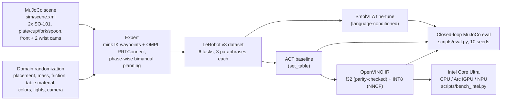

# Bimanual Dinner-Table VLA: dual SO-101 in MuJoCo, optimized with OpenVINO

Two simulated SO-101 arms set a dinner table from natural-language commands:
- single-arm placements
- simultaneous dual-arm placement
- a hand-off between the arms
- a multi-step full place setting

Demonstrations come from a motion-planning expert (mink IK + OMPL), collected under domain randomization into
LeRobot v3 datasets. They train **SmolVLA** (language + 3 cameras → 12-D joint actions) and an **ACT**
baseline. Both run closed-loop back in MuJoCo. ACT is exported to **OpenVINO** in f32 and INT8, benchmarked on
CPU / iGPU / NPU, and reproducible on Intel hardware with one command.

> Demo video: _link pending_

## Architecture



**Observe → Understand → Plan → Act → Optimize:**
1. **Observe:** front + two wrist cameras, plus 12-D joint state.
2. **Understand:** SmolVLA fuses the instruction with the images (SmolVLM2 backbone).
3. **Plan:** SmolVLA's action expert predicts 50-step action chunks for both arms jointly.
4. **Act:** the chunks run as dual SO-101 joint position targets at 30 Hz.
5. **Optimize:** ACT goes through OpenVINO f32 / INT8 on CPU, iGPU or NPU.

## Tasks

| Task | Bimanual pattern | Train instructions (3 per task, one shown) | Held-out eval instruction |
|---|---|---|---|
| `fork_left` | left arm | "Place the fork to the left of the plate." | "Position the fork left of the plate." |
| `spoon_right` | right arm | "Place the spoon to the right of the plate." | "Position the spoon right of the plate." |
| `cup_tr` | right arm | "Put the cup at the top right of the plate." | "Move the cup to the upper right corner of the place setting." |
| `set_table` | **both arms simultaneously** | "Set the table." | "Arrange the cutlery for a meal." |
| `handoff_fork` | **hand-off** (right → relay → left) | "Hand the fork from the right arm to the left arm and place it left of the plate." | "Transfer the fork between the arms and put it on the plate's left side." |
| `full_setting` | **multi-step**: fork + spoon together, then cup | "Set a full place setting: fork, spoon, then cup." | "Lay out the fork, the spoon and finally the cup for dinner." |

A task succeeds only when all of these hold:
- every object is within 3 cm of its target and resting on the table
- cutlery is within 45° of the target yaw
- the cup is within 30° of upright (an upside-down cup fails)
- every arm involved has released

## Bimanual coordination strategy

A task is a list of **phases** (`dinner/env.py: task_phases`):
- **Within a phase, arms move simultaneously.** Each arm is planned against the other arm's pose in that phase, so collision checking covers the other arm.
- **Phases run in order.** Each phase is planned from the simulator state the previous one left, so small placement errors don't compound.

That one mechanism gives three behaviors:
- **Simultaneous** (`set_table`): both arms place cutlery at once.
- **Sequence** (`full_setting`): fork and spoon together, then the cup is placed next to the already-placed spoon.
- **Hand-off** (`handoff_fork`): the fork starts out of the left arm's reach. The right arm sets it on a relay pad both arms can reach, and the left arm picks it up there and places it. An in-air hand-off was prototyped (the giver holds the handle tail while the taker grips the other end), but the taker's grip slipped when the giver released, so the relay is used.

Expert per pick-place:
1. mink IK solves collision-checked pregrasp / grasp / above-target / place poses.
2. OMPL RRTConnect plans the transits in joint space. The validity checker covers the table, the other arm, objects and self-collision, and restores the sim state after every check.
3. The return-home path is planned around the object at its new position.

Expert success (10 seeds each): **10/10 on all six tasks**.

## Training approach

- **Data:** about 50 successful expert episodes per task at 30 fps, recorded with `observation.images.{front,left_wrist,right_wrist}` (256×256), `observation.state` (12) and `action` (12). Each episode is labeled with one of the task's 3 train paraphrases.
- **SmolVLA:** fine-tuned from `lerobot/smolvla_base` with the vision encoder frozen and only the action expert trained. The dataset cameras are mapped onto the base model's `camera1..3`. Trained on an Apple M4 (MPS) within a fixed time budget; step counts are under Quickstart.
- **ACT:** trained from scratch on `set_table`. It has no language input, so it serves as the OpenVINO deployment baseline.

## Robustness

Every episode is randomized. Each range below is multiplied by a level: nominal = 1.0 (training and main eval), heavy = 1.5 (a stress test beyond the training distribution).

| Factor | Nominal range |
|---|---|
| Object and plate placement | ±4 cm, ±30° yaw; rejection-sampled with no overlaps, nothing on a target or the relay |
| Object weight and friction | ±20% |
| Table / background | 3 table materials (checker, wood, grey) |
| Object colors | ±0.15 RGB |
| Lighting | position ±0.3 m, intensity ±30%, shadows on in 80% of episodes |
| Front camera | position ±2 cm, look-at ±4 cm, field of view ±5° |

Evaluation seeds (≥ 10000) never overlap collection seeds.

## OpenVINO optimization and Intel hardware mapping

| Stage | Component | Intel target | Precision |
|---|---|---|---|
| Policy inference (deployment) | ACT → OpenVINO IR | CPU (P-cores) | f32, parity-checked against PyTorch to within 1e-3 rad |
| Policy inference (fast path) | ACT → OpenVINO IR | Arc iGPU (`GPU`) | f16 (device default) |
| Policy inference (low power) | ACT → OpenVINO IR | NPU | f16 |
| Model compression | ACT INT8 IR (NNCF) | CPU / GPU / NPU | INT8; closed-loop success is compared against f32 |
| VLA inference | SmolVLA (PyTorch) | Arc iGPU via PyTorch XPU (`--device xpu`), or CPU | f32 |
| Simulation + rendering | MuJoCo + EGL | CPU + iGPU | — |

- **Parity is checked end to end.** The full PyTorch pipeline (processors + policy) is compared against processors + IR, so double or missing normalization would show up.
- **CPU precision is pinned to f32.** OpenVINO's CPU default on some platforms (f16 on ARM, bf16 on AMX Xeons) alone breaks the 1e-3 parity.
- **Task quality is preserved by measurement:** `scripts.eval --backend openvino` runs closed-loop episodes on each device and precision, so the success-rate change is measured, not assumed.

SmolVLA's flow-matching action expert isn't exportable through `optimum`. `export_openvino.py --smolvla-ckpt` documents the attempt and exports the vision encoder.

## Quickstart

```bash
uv sync                                        # Python 3.12, pinned lerobot==0.6.1 (uv.lock)
uv run python -m dinner.env                    # scene/env self-check (asserts)
uv run python -m dinner.expert --seeds 10      # expert success per task
```

**1. Collect** (50 episodes per task, all six tasks):
```bash
uv run python -m scripts.collect --episodes-per-task 50
```

**2. Train** (Apple Silicon shown; `--policy.device=cuda` on NVIDIA, `xpu` on Intel Arc):
```bash
PYTORCH_ENABLE_MPS_FALLBACK=1 uv run lerobot-train --policy.type=act --policy.device=mps --policy.push_to_hub=false \
  --dataset.repo_id=local/dinner_set_table --dataset.root=data/dinner_set_table \
  --batch_size=8 --steps=8000 --save_freq=2000 --output_dir=outputs/train/act_dinner --wandb.enable=false

PYTORCH_ENABLE_MPS_FALLBACK=1 uv run lerobot-train --policy.path=lerobot/smolvla_base --policy.device=mps --policy.push_to_hub=false \
  --dataset.repo_id=local/dinner_table --dataset.root=data/dinner_table \
  --rename_map='{"observation.images.front": "observation.images.camera1", "observation.images.left_wrist": "observation.images.camera2", "observation.images.right_wrist": "observation.images.camera3"}' \
  --batch_size=8 --steps=5500 --policy.scheduler_decay_steps=5500 --save_freq=1000 \
  --output_dir=outputs/train/smolvla_dinner --wandb.enable=false
```

**3. Closed-loop evaluation** (10 held-out randomized seeds per task; videos end with a SUCCESS/FAIL banner):
```bash
CKPT=outputs/train/smolvla_dinner/checkpoints/last/pretrained_model
uv run python -m scripts.eval --policy smolvla --ckpt $CKPT --episodes 10 --video --video-episodes 10
uv run python -m scripts.eval --policy smolvla --ckpt $CKPT --episodes 10 --paraphrases eval   # unseen wording
uv run python -m scripts.eval --policy smolvla --ckpt $CKPT --episodes 10 --rand heavy         # 1.5x randomization
uv run python -m scripts.make_reel results/videos/smolvla_torch_nominal_train_set_table_ep*.mp4 --out results/videos/reel_set_table.mp4
uv run mjpython -m scripts.eval --policy smolvla --ckpt $CKPT --viewer                          # live viewer (macOS)
```

**4. OpenVINO export, benchmark and closed-loop on the IR:**
```bash
ACT=outputs/train/act_dinner/checkpoints/last/pretrained_model
uv run python -m scripts.export_openvino --act-ckpt $ACT     # f32 IR + parity, INT8 IR
uv run python -m scripts.bench_intel --ckpt $ACT             # latency, throughput, device, precision
uv run python -m scripts.eval --policy act --ckpt $ACT --backend openvino --ov-device GPU --episodes 10
uv run python -m scripts.eval --policy act --ckpt $ACT --backend openvino --ir results/act_dinner_int8.xml --episodes 10
```

### Reproducing on Intel hardware (one command)

On an Intel Core Ultra system (Ubuntu 24.04, Arc iGPU + NPU):
```bash
bash scripts/intel_quickstart.sh <act pretrained_model dir or HF repo id>
```
In one run the script:
- builds the exact locked environment (Python 3.12)
- runs the sim self-check
- exports ACT (f32 with the parity check, plus INT8)
- benchmarks torch vs OpenVINO on CPU, GPU and NPU
- runs closed-loop MuJoCo episodes on the IR for each device

`uv.lock` has been verified to install on Linux x86_64 (all packages have wheels). Intel numbers come only from running this on Intel hardware. The development machine is Apple Silicon, where `bench_intel.py` marks its output `intel: false`.

**Docker** (CPU, headless):
```bash
docker build -t dinner-vla .
docker run --rm -v $PWD/outputs/train/smolvla_dinner/checkpoints/last/pretrained_model:/app/ckpt:ro \
  -v $PWD/results:/app/results dinner-vla --policy smolvla --ckpt /app/ckpt --episodes 1 --video
```

## Results

Generated from `results/*.json` with `python -m scripts.results_table --latency`. Every run uses held-out seeds
(≥ 10000, never collected from), 10 episodes per task. Cells show full-task success; for multi-object tasks the
per-object placement counts follow.

| Policy | Backend | Randomization | Instructions | fork_left | spoon_right | cup_tr | set_table | handoff_fork | full_setting |
|---|---|---|---|---|---|---|---|---|---|
| Expert (upper bound) | — | nominal | — | 10/10 | 10/10 | 10/10 | 10/10 | 10/10 | 10/10 |
| SmolVLA | torch | nominal | train | 1/10 | 2/10 | 0/10 | 0/10 (spoon 1) | 0/10 | 0/10 (fork 1, spoon 1) |
| SmolVLA | torch | nominal | held-out | 0/10 | 0/10 | 0/10 | 0/10 | 0/10 | 0/10 |
| SmolVLA | torch | heavy | train | 0/10 | 0/10 | 0/10 | 0/10 | 0/10 | 0/10 |
| ACT | torch | nominal | — | n/a | n/a | n/a | 0/10 (spoon 5, fork 0) | n/a | n/a |
| ACT | OpenVINO f32 | nominal | — | n/a | n/a | n/a | 1/10 (spoon 5, fork 1) | n/a | n/a |
| ACT | OpenVINO INT8 | nominal | — | n/a | n/a | n/a | 1/10 (spoon 4, fork 1) | n/a | n/a |
| ACT | torch | heavy | — | n/a | n/a | n/a | 0/10 (spoon 1, fork 0) | n/a | n/a |

### What these numbers mean

**Both learned policies are undertrained, and the limit is compute, not the pipeline.** The expert solves all six
tasks 10/10, so the tasks, the success criteria and the demonstrations are sound. SmolVLA got **4,500 steps ≈
0.44 epochs** over 82k frames and ACT 8,000 steps over 11k frames, both on a laptop GPU (Apple M4, 5.7 s/step for
SmolVLA — a 7-hour run). The SmolVLA paper fine-tunes for 20k steps at batch 64, roughly **30× the samples** this
run saw; on a CUDA GPU that recipe is well under an hour. Four hours of the training budget were also lost to two
dataset-related crashes and a period where the machine was in low power mode.

Evidence that the pipeline is correct rather than just an assertion:
- **Images reach the policy.** The checkpoint's saved preprocessor carries the camera rename map, and at inference
  the policy receives `observation.images.camera1..3` (verified by inspecting the processed batch).
- **Predicted actions track the expert.** Open-loop on training frames, SmolVLA is 0.072 rad from the expert's
  action and ACT 0.089 — wrong by centimetres, not nonsense.
- **Behaviour is purposeful.** Both policies reach over the table, approach objects, close the gripper and return
  home. They miss grasps by 3–5 cm, and SmolVLA sometimes drives the wrong arm for the instruction.
- **Partial credit is visible.** ACT places the spoon in 5/10 episodes; SmolVLA completes 3 single-arm episodes and
  places individual objects inside multi-object tasks.

**Language grounding did not form.** SmolVLA scores 3/60 on training wording and 0/60 on held-out wording. A policy
that had grounded the instruction would degrade gracefully on paraphrases; falling to zero says it leaned on
memorised wording. At 0.44 epochs that is the expected outcome, and it is the first thing more training would fix.

**Randomization bites.** At 1.5× ranges both policies fall to zero (ACT's spoon placement 5/10 → 1/10), so the
randomization is doing real work rather than decorating the training set.

**ACT findings:**
- **Behaviour.** ACT learned the simultaneous dual-arm sequence (both arms reach, grasp, carry, place, return). The right-arm spoon placement succeeds in half the seeds, but the left-arm fork grasp misses by 3–5 cm and closes early. Temporal ensembling (0/3) and an earlier checkpoint (0/3) didn't fix it.
- **OpenVINO preserves behaviour.** Across torch, f32 and INT8, the per-object placement counts match within one episode (spoon 5 / 5 / 4).
- **Latency.** p50 per action chunk on the development CPU: torch 131 ms, OpenVINO f32 119 ms, OpenVINO INT8 **50 ms** (2.6×). That's an Apple M4, measured while SmolVLA trained on the same machine; Intel numbers come from `scripts/intel_quickstart.sh`.
- **Export.** f32 parity with PyTorch is 4.8e-4 rad. The INT8 model (weights and activations, NNCF with 300 calibration scenes) is 66 MB → 34 MB, with a maximum action difference of 0.016 rad from f32.

## Demo video plan

The evaluation already renders everything the demo needs: every episode video carries the command text,
inference latency, seed and randomization level, and ends on a SUCCESS/FAIL banner listing which objects were
placed. `scripts/make_reel.py` tiles 10 seeds of a task into one grid clip.

Suggested 1–2 minute sequence:
1. **Command → action.** One `fork_left` episode full-frame: the instruction is on screen, the scene is randomized, and the left arm places the fork.
2. **Dual-arm at once.** One `set_table` episode: both arms work simultaneously.
3. **Hand-off.** One `handoff_fork` episode: the fork starts out of the left arm's reach, the right arm sets it on the relay, the left arm takes it and places it. This is the coordinated two-arm beat the brief asks for.
4. **Multi-step.** One `full_setting` episode: fork and spoon together, then the cup.
5. **10 randomized seeds.** `results/videos/reel_*.mp4` grids, one per task, with the success rate on screen.
6. **Intel optimization.** The benchmark chart: PyTorch vs OpenVINO f32 vs INT8, and the parity number. Run `scripts/intel_quickstart.sh` on Core Ultra hardware for figures that can be labelled Intel.

Assets: `results/videos/` (per-episode clips and reels), `results/*.json` (numbers behind every claim),
`python -m scripts.results_table --latency` (the table, regenerated from those JSON files).

## Rubric mapping

| Criterion | Where to look |
|---|---|
| End-to-end task + bimanual (30) | 6 tasks including simultaneous, hand-off and multi-step (`dinner/env.py`, `dinner/expert.py`); results table; reels |
| VLA / multi-modal reasoning (20) | SmolVLA conditioned on language + 3 cameras; held-out instruction row; `full_setting` multi-step context |
| Robustness (15) | Randomization table; nominal vs heavy rows; 10 held-out seeds per task |
| OpenVINO + Core Ultra (20) | `export_openvino.py` (parity, INT8), `bench_intel.py` (latency, throughput, device, precision), `eval.py --backend openvino` (task success on the IR), `intel_quickstart.sh` |
| Quality + reproducibility (10) | `uv.lock`, self-checks, one-command Intel script, Dockerfile, deterministic seeds |
| Innovation (5) | Phase-wise closed-loop bimanual planner; end-to-end processor parity check; closed-loop INT8 quality check |

## Limitations

- **The learned policies are undertrained** (SmolVLA 0.44 epochs, ACT 8k steps on a laptop GPU). The expert is the
  upper bound at 10/10 on all six tasks; closing the gap is a matter of GPU hours on the same pipeline, not a
  redesign. Train with `--policy.device=cuda --steps=20000 --batch_size=64` to reproduce the reference recipe.
- **The plate isn't grasped.** It's a randomized reference object; a thin disc isn't graspable by the SO-101 jaw.
- **The hand-off goes through a relay pad, not in the air.**
- **ACT has no language input,** so it covers `set_table` only; SmolVLA covers all tasks.
- **SmolVLA isn't OpenVINO-exported end to end;** its Intel path is PyTorch XPU/CPU.
- **The shipped SmolVLA dataset was assembled from two collection passes.** Single-arm and `set_table` episodes predate the phase planner; `cup_tr`, `handoff_fork` and `full_setting` were recollected with the final layout. `scripts.collect` reproduces all six tasks in one pass.
- **293 episodes, not 300:** `handoff_fork` has 43. A collector killed mid-encode (memory pressure) left 432 rows of an unregistered episode in its data parquet. Metadata stayed self-consistent, but absolute row indices shifted every later episode, so frames were read against another episode's video timestamps — silently, until a lookup ran past a video file's end and crashed training at the same step twice. That 7-episode shard is excluded; `scripts/validate_dataset.py` checks for orphan rows, frame-index overshoot and per-file frame counts, and is worth running on any assembled dataset before training.

## Repo layout

```
sim/scene.xml              scene: table, objects, relay, cameras, lights, 2x <attach> SO-101
sim/so101/                 MuJoCo Menagerie robotstudio_so101 @ 8161bba (Apache-2.0)
dinner/env.py              env, tasks + phases + paraphrases, randomization, success
dinner/expert.py           mink IK + OMPL expert, phase-wise bimanual planning, rollout()
scripts/collect.py         expert -> LeRobot datasets
scripts/eval.py            closed-loop eval (torch / OpenVINO CPU|GPU|NPU), metrics JSON, videos
scripts/make_reel.py       tile episode videos into a 10-seed grid
scripts/export_openvino.py ACT -> ONNX -> IR (f32 parity) + INT8; SmolVLA attempt
scripts/bench_intel.py     latency / throughput per device and precision
scripts/intel_quickstart.sh one-command reproduction on Intel hardware
```
