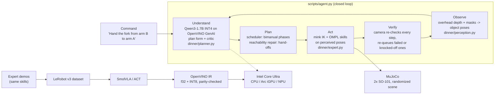

# Bimanual Dinner-Table Agent: dual SO-101 in MuJoCo, language-driven, optimized with OpenVINO

Two simulated SO-101 arms set a dinner table from natural-language commands:
- single-arm placements
- simultaneous dual-arm placement
- a hand-off between the arms
- multi-step settings, and free-form commands that name "arm A" / "arm B"

The repo has two ways to go from a command to motion:

1. **The agent** (`scripts/agent.py`, the main system):
   - **Plan:** an INT4 LLM running on **OpenVINO GenAI** turns the command and the scene seen by the camera into a bimanual plan.
   - **Act:** the plan runs on motion-planning skills (mink IK + OMPL), using object poses perceived from the overhead camera.
   - **Verify:** the camera checks every step and re-plans when something goes wrong.
2. **End-to-end learned policies:**
   - **SmolVLA** takes language + 3 cameras and outputs 12-D joint actions; **ACT** is the baseline.
   - Both are trained on the expert's demonstrations.
   - Both are exported to **OpenVINO** in f32 and INT8, and the parity and closed-loop checks are run on the exported models.

Everything is benchmarked per OpenVINO device (CPU / iGPU / NPU) and can be reproduced on Intel hardware with one command.

> Demo video: _link pending_. `results/videos/demo.mp4` (2.5 min) is built with `python -m scripts.make_demo`.
>
> Headline: on 10 held-out randomized seeds per task, the agent completes 56/60 episodes (nominal), 56/60 with unseen instruction wording, 49/60 under 1.5× randomization, and 45/50 free-form arm-naming commands. The expert with ground-truth poses scores 57/60 and 49/60. Everything reported here, including the demo, ran on one Apple M4 laptop; no Intel Core Ultra hardware was available (see Limitations).

## Architecture



**Observe → Understand → Plan → Act → Verify → Optimize:**
1. **Observe.** The overhead camera's depth image and instance masks give each object's position and heading (cutlery) and whether it is upright (cup). Accuracy against simulator ground truth, heavy randomization, 20 scenes: mean 0.6 mm, max 2.1 mm; cutlery heading max 3.4°.
   - The instance masks come from MuJoCo's segmentation buffer, standing in for a trained detector.
   - The plate is a plain disc with no visible heading, so the place-setting's orientation is taken from the scene layout.
2. **Understand.** Qwen3-1.7B (INT4, OpenVINO GenAI, JSON-schema-constrained) fills in a fixed form for each object: move it or not, hand-off or not, which arm, which target, plus the order.
   - A critic checks the form against the command's words (objects named, hand-off verbs). On a mismatch it asks the LLM once more; it never edits the plan itself.
   - Plan accuracy: **28/29** commands with the critic, 24/29 without (`python -m dinner.planner --check`).
3. **Plan.** A scheduler groups the steps into phases: steps on different arms with different objects run at the same time, and a hand-off always waits for the giving arm.
   - If a step can't be planned (IK or collision), repair tries the other arm, then a hand-off over the relay pad.
4. **Act.** Each phase runs as simultaneous joint trajectories. They are planned on the *perceived* object poses and the current arm joint angles.
5. **Verify.** After each phase the camera re-checks every step taken so far.
   - A step that failed, or an object that was knocked off its target, is re-planned from where the object now is.
   - The final pass/fail is always the simulator's own success check.
6. **Optimize.** The planner runs as INT4 on OpenVINO. ACT and SmolVLA are exported to OpenVINO IR in f32 (parity-checked) and INT8, and benchmarked per device.

## Tasks

| Task | Bimanual pattern | Train instructions (3 per task, one shown) | Held-out eval instruction |
|---|---|---|---|
| `fork_left` | left arm | "Place the fork to the left of the plate." | "Position the fork left of the plate." |
| `spoon_right` | right arm | "Place the spoon to the right of the plate." | "Position the spoon right of the plate." |
| `cup_tr` | right arm | "Put the cup at the top right of the plate." | "Move the cup to the upper right corner of the place setting." |
| `set_table` | **both arms simultaneously** | "Set the table." | "Arrange the cutlery for a meal." |
| `handoff_fork` | **hand-off** (right → relay → left) | "Hand the fork from the right arm to the left arm and place it left of the plate." | "Transfer the fork between the arms and put it on the plate's left side." |
| `full_setting` | **multi-step**: fork + spoon together, then cup | "Set a full place setting: fork, spoon, then cup." | "Lay out the fork, the spoon and finally the cup for dinner." |

A task succeeds only when all of these hold:
- every object is within 3 cm of its target and resting on the table
- cutlery is within 45° of the target yaw
- the cup is within 30° of upright (an upside-down cup fails)
- every arm involved has released

## Bimanual coordination strategy

A task is a list of **phases** (`dinner/env.py: task_phases`):
- **Within a phase, arms move simultaneously.** Each arm is planned against the other arm's pose in that phase, so collision checking covers the other arm.
- **Phases run in order.** Each phase is planned from the simulator state the previous one left, so small placement errors don't compound.

That one mechanism gives three behaviors:
- **Simultaneous** (`set_table`): both arms place cutlery at once.
- **Sequence** (`full_setting`): fork and spoon together, then the cup is placed next to the already-placed spoon.
- **Hand-off** (`handoff_fork`): the fork starts out of the left arm's reach. The right arm sets it on a relay pad both arms can reach, and the left arm picks it up there and places it. An in-air hand-off was prototyped (the giver holds the handle tail while the taker grips the other end), but the taker's grip slipped when the giver released, so the relay is used.

Expert per pick-place:
1. mink IK solves collision-checked pregrasp / grasp / above-target / place poses.
2. OMPL RRTConnect plans the transits in joint space. The validity checker covers the table, the other arm, objects and self-collision, and restores the sim state after every check.
3. The return-home path is planned around the object at its new position.

Expert success (10 seeds each): **10/10 on all six tasks**.

## Training approach

- **Data:** about 50 successful expert episodes per task at 30 fps, recorded with `observation.images.{front,left_wrist,right_wrist}` (256×256), `observation.state` (12) and `action` (12). Each episode is labeled with one of the task's 3 train paraphrases.
- **SmolVLA:** fine-tuned from `lerobot/smolvla_base` with the vision encoder frozen and only the action expert trained. The dataset cameras are mapped onto the base model's `camera1..3`. Trained on an Apple M4 (MPS) within a fixed time budget; step counts are under Quickstart.
- **ACT:** trained from scratch on `set_table`. It has no language input, so it serves as the OpenVINO deployment baseline.

## Robustness

Every episode is randomized. Each range below is multiplied by a level: nominal = 1.0 (training and main eval), heavy = 1.5 (a stress test beyond the training distribution).

| Factor | Nominal range |
|---|---|
| Object and plate placement | ±4 cm, ±30° yaw; rejection-sampled with no overlaps, nothing on a target or the relay |
| Object weight and friction | ±20% |
| Table / background | 3 table materials (checker, wood, grey) |
| Object colors | ±0.15 RGB |
| Lighting | position ±0.3 m, intensity ±30%, shadows on in 80% of episodes |
| Front camera | position ±2 cm, look-at ±4 cm, field of view ±5° |

Evaluation seeds (≥ 10000) never overlap collection seeds.

## OpenVINO optimization and Intel hardware mapping

| Stage | Component | Intel target | Precision |
|---|---|---|---|
| Language planning | Qwen3-1.7B → OpenVINO GenAI `LLMPipeline`, JSON-schema-constrained decoding | CPU, or Arc iGPU / NPU (`--planner-device`) | INT4 weights |
| Perception | depth + masks → poses (NumPy geometry) | CPU | f32 |
| Policy inference (deployment) | ACT → OpenVINO IR | CPU (P-cores) | f32, parity-checked against PyTorch to within 1e-3 rad |
| Policy inference (fast path) | ACT → OpenVINO IR | Arc iGPU (`GPU`) | f16 (device default) |
| Policy inference (low power) | ACT → OpenVINO IR | NPU | f16 |
| Model compression | ACT INT8 IR (NNCF PTQ, weights + activations) | CPU / GPU / NPU | INT8; closed-loop success compared against f32 |
| VLA inference | SmolVLA full sampler (SigLIP + SmolVLM prefix + 10 flow-matching steps) → one OpenVINO IR | CPU / Arc iGPU | f32, parity-checked (3.2e-4 rad); INT8 weights (NNCF) |
| Simulation + rendering | MuJoCo + EGL | CPU + iGPU | — |

- **Parity is checked end to end.** The full PyTorch pipeline (processors + policy) is compared against processors + IR, so double or missing normalization would show up.
- **SmolVLA is exported whole, flow-matching loop included.**
  - The prefix KV cache is built once inside the graph, and the 10 Euler steps are unrolled at trace time.
  - Noise is an input, so the IR is deterministic and parity-checkable.
  - Two transformers internals had to be patched for tracing, both exactly (see `export_smolvla`): the all-ones vision patch mask, and the empty-tensor start of the KV cache.
  - The checkpoint loads its VLM in bf16, so export and parity use f32; bf16 PyTorch differs from f32 by about 3e-3 rad after 10 steps.
- **CPU precision is pinned to f32 for parity.** OpenVINO's CPU default on some platforms (f16 on ARM, bf16 on AMX Xeons) alone breaks the 1e-3 parity.
- **Task quality is preserved by measurement:** `scripts.eval --backend openvino` runs closed-loop episodes on each device and precision, so the success-rate change is measured, not assumed.
- **Honest latency:** every number below was measured on the development machine, an Apple M4 (`intel: false` in `results/intel_bench.json`).
  - ACT per action chunk: PyTorch 42 ms, OpenVINO f32 48 ms, f16 28 ms, INT8 26 ms. So f16 and INT8 are 1.5–1.6× faster; f32 alone is not.
  - SmolVLA per chunk: PyTorch f32 1071 ms, OpenVINO f32 2023 ms, f16 1141 ms, INT8 weights + f16 1172 ms. OpenVINO is *not* faster for this model on an ARM CPU.
  - The planner takes 8.2 s per plan on CPU (INT4 weights, unpacked on ARM).
  - Intel Core Ultra figures come only from `scripts/intel_quickstart.sh` run on that hardware.

## Quickstart

```bash
uv sync                                        # Python 3.12, pinned lerobot==0.6.1 (uv.lock)
uv run python -m dinner.env                    # scene/env self-check (asserts)
uv run python -m dinner.expert --seeds 10      # expert success per task
```

**0. The agent** (no training needed; downloads the ~1.1 GB INT4 planner):
```bash
bash scripts/get_models.sh
uv run python -m dinner.perception                                   # perception accuracy self-check
uv run python -m dinner.planner --check                              # plan accuracy (29 commands)
uv run python -m scripts.agent --command "Hand the fork from arm B to arm A and place it left of the plate." \
  --layout handoff_fork --video                                      # one command, video in results/videos/
bash scripts/eval_agent_all.sh                                       # every agent row of the results table
uv run python -m scripts.make_demo                                   # results/videos/demo.mp4
```

**1. Collect** (50 episodes per task, all six tasks):
```bash
uv run python -m scripts.collect --episodes-per-task 50
```

**2. Train** (Apple Silicon shown; `--policy.device=cuda` on NVIDIA, `xpu` on Intel Arc):
```bash
PYTORCH_ENABLE_MPS_FALLBACK=1 uv run lerobot-train --policy.type=act --policy.device=mps --policy.push_to_hub=false \
  --dataset.repo_id=local/dinner_set_table --dataset.root=data/dinner_set_table \
  --batch_size=8 --steps=8000 --save_freq=2000 --output_dir=outputs/train/act_dinner --wandb.enable=false

PYTORCH_ENABLE_MPS_FALLBACK=1 uv run lerobot-train --policy.path=lerobot/smolvla_base --policy.device=mps --policy.push_to_hub=false \
  --dataset.repo_id=local/dinner_table --dataset.root=data/dinner_table \
  --rename_map='{"observation.images.front": "observation.images.camera1", "observation.images.left_wrist": "observation.images.camera2", "observation.images.right_wrist": "observation.images.camera3"}' \
  --batch_size=8 --steps=5500 --policy.scheduler_decay_steps=5500 --save_freq=1000 \
  --output_dir=outputs/train/smolvla_dinner --wandb.enable=false
```

**3. Closed-loop evaluation** (10 held-out randomized seeds per task; videos end with a SUCCESS/FAIL banner):
```bash
CKPT=outputs/train/smolvla_dinner/checkpoints/last/pretrained_model
uv run python -m scripts.eval --policy smolvla --ckpt $CKPT --episodes 10 --video --video-episodes 10
uv run python -m scripts.eval --policy smolvla --ckpt $CKPT --episodes 10 --paraphrases eval   # unseen wording
uv run python -m scripts.eval --policy smolvla --ckpt $CKPT --episodes 10 --rand heavy         # 1.5x randomization
uv run python -m scripts.make_reel results/videos/smolvla_torch_nominal_train_set_table_ep*.mp4 --out results/videos/reel_set_table.mp4
uv run mjpython -m scripts.eval --policy smolvla --ckpt $CKPT --viewer                          # live viewer (macOS)
```

**4. OpenVINO export, benchmark and closed-loop on the IR:**
```bash
ACT=outputs/train/act_dinner/checkpoints/last/pretrained_model
uv run python -m scripts.export_openvino --act-ckpt $ACT --smolvla-ckpt $CKPT   # f32 IRs + parity, INT8 IRs
uv run python -m scripts.bench_intel --ckpt $ACT --smolvla-ckpt $CKPT --planner  # latency, throughput, device, precision
uv run python -m scripts.eval --policy act --ckpt $ACT --backend openvino --ov-device GPU --episodes 10
uv run python -m scripts.eval --policy act --ckpt $ACT --backend openvino --ir results/act_dinner_int8.xml --episodes 10
uv run python -m scripts.eval --policy smolvla --ckpt $CKPT --backend openvino --ov-device GPU --episodes 10
```

### Reproducing on Intel hardware (one command)

On an Intel Core Ultra system (Ubuntu 24.04, Arc iGPU + NPU):
```bash
bash scripts/intel_quickstart.sh <act pretrained_model dir or HF repo id> [smolvla pretrained_model dir]
```
In one run the script:
- builds the exact locked environment (Python 3.12)
- runs the sim self-check
- downloads the INT4 planner and self-checks perception
- exports ACT (and SmolVLA, if given) to OpenVINO: f32 with the parity check, plus INT8
- benchmarks torch vs OpenVINO on CPU, GPU and NPU, including the planner LLM
- runs the agent evaluation with the planner on each device
- runs closed-loop MuJoCo policy episodes on the IRs for each device

`uv.lock` has been verified to install on Linux x86_64 (all packages have wheels). Intel numbers come only from running this on Intel hardware. The development machine is Apple Silicon, where `bench_intel.py` marks its output `intel: false`.

**Docker** (CPU, headless):
```bash
docker build -t dinner-vla .
docker run --rm -v $PWD/outputs/train/smolvla_dinner/checkpoints/last/pretrained_model:/app/ckpt:ro \
  -v $PWD/results:/app/results dinner-vla --policy smolvla --ckpt /app/ckpt --episodes 1 --video
```

## Results

Every run uses held-out seeds (≥ 10000, never collected from), 10 episodes per task. Cells show full-task success; for multi-object tasks the per-object placement counts follow.

The agent's task success is the simulator's check on the *task's* objects:
- A plan that moves an object the command didn't ask for counts as a failure.
- `handoff_fork` also requires both hand-off steps to have happened with the right arms.

The table below is generated by `python -m scripts.results_table --latency --readme README.md`, and `bash scripts/eval_agent_all.sh` reruns every agent row. OMPL is seeded, so the runs repeat exactly.

<!-- results:begin -->
| Policy | Backend | Randomization | Instructions | fork_left | spoon_right | cup_tr | set_table | handoff_fork | full_setting |
|---|---|---|---|---|---|---|---|---|---|
| Expert (ground-truth poses, upper bound) | — | nominal | — | 10/10 | 10/10 | 9/10 | 9/10 | 10/10 | 9/10 |
| Expert (ground-truth poses, upper bound) | — | heavy | — | 9/10 | 9/10 | 9/10 | 9/10 | 9/10 | 4/10 |
| **Agent** (LLM planner + perception + skills) | OpenVINO INT4 planner | nominal | train | 10/10 | 10/10 | 9/10 | 9/10 | 10/10 | 8/10 |
| **Agent** (LLM planner + perception + skills) | OpenVINO INT4 planner | nominal | held-out | 10/10 | 10/10 | 9/10 | 9/10 | 10/10 | 8/10 |
| **Agent** (LLM planner + perception + skills) | OpenVINO INT4 planner | heavy | train | 9/10 | 9/10 | 8/10 | 9/10 | 9/10 | 5/10 |
| **Agent** (LLM planner + perception + skills), object knocked off mid-task | OpenVINO INT4 planner | nominal | train | 10/10 | 10/10 | 8/10 | 9/10 | 10/10 | 9/10 |
| **Agent** (LLM planner + perception + skills), one object already placed | OpenVINO INT4 planner | nominal | train | n/a | n/a | n/a | 10/10 | n/a | 8/10 |
| SmolVLA | torch | nominal | train | 1/10 | 2/10 | 0/10 | 0/10 (fork 0, spoon 1) | 0/10 | 0/10 (fork 1, spoon 1, cup 0) |
| SmolVLA | OpenVINO f32 | nominal | train | 0/10 | 0/10 | n/a | 0/10 (fork 0, spoon 0) | n/a | n/a |
| SmolVLA | OpenVINO INT8 | nominal | train | 0/10 | 0/10 | n/a | 0/10 (fork 0, spoon 1) | n/a | n/a |
| SmolVLA | torch | nominal | held-out | 0/10 | 0/10 | 0/10 | 0/10 (fork 0, spoon 0) | 0/10 | 0/10 (fork 0, spoon 0, cup 0) |
| SmolVLA | torch | heavy | train | 0/10 | 0/10 | 0/10 | 0/10 (fork 0, spoon 0) | 0/10 | 0/10 (fork 0, spoon 0, cup 0) |
| ACT | torch | nominal | — | n/a | n/a | n/a | 0/10 (fork 0, spoon 5) | n/a | n/a |
| ACT | OpenVINO f32 | nominal | — | n/a | n/a | n/a | 1/10 (fork 1, spoon 5) | n/a | n/a |
| ACT | OpenVINO INT8 | nominal | — | n/a | n/a | n/a | 1/10 (fork 1, spoon 4) | n/a | n/a |
| ACT | torch | heavy | — | n/a | n/a | n/a | 0/10 (fork 0, spoon 1) | n/a | n/a |

| Free-form command (agent) | Success |
|---|---|
| Hand the fork from arm B to arm A and place it left of the plate. | 10/10 |
| Arm B, put the cup at the top right, and arm A, put the fork left of the plate. | 9/10 |
| Set the table, then put the cup at the top right. | 9/10 |
| Pass the spoon to arm A and have it place the spoon left of the plate. | 10/10 |
| Arm A, put the fork left of the plate. Arm B, put the spoon on the right, then the cup at the top right. | 7/10 |

- `smolvla_torch_nominal_train`: p50 712 ms, p95 717 ms per action chunk on mps
- `smolvla_openvino-cpu_nominal_train`: p50 2102 ms, p95 3045 ms per action chunk on CPU
- `smolvla_openvino-cpu-int8_nominal_train`: p50 2035 ms, p95 2257 ms per action chunk on CPU
- `smolvla_torch_nominal_eval`: p50 714 ms, p95 720 ms per action chunk on mps
- `smolvla_torch_heavy_train`: p50 715 ms, p95 719 ms per action chunk on mps
- `act_torch_nominal_train`: p50 131 ms, p95 337 ms per action chunk on cpu
- `act_openvino-cpu_nominal_train`: p50 118 ms, p95 327 ms per action chunk on CPU
- `act_openvino-cpu-int8_nominal_train`: p50 50 ms, p95 189 ms per action chunk on CPU
- `act_torch_heavy_train`: p50 78 ms, p95 258 ms per action chunk on cpu
- planner `qwen3-1.7b-int4-ov` on CPU: p50 7.1 s per generation (19 uncached)
- bench machine: Apple M4 (intel=False), OpenVINO 2026.3.1-22476-759c5a6ab8c-releases/2026/3
  - act_torch_cpu: p50 42.0 ms, 23.6 inferences/s
  - act_openvino_cpu_f32: p50 48.1 ms, 20.8 inferences/s
  - act_openvino_cpu_f16: p50 27.7 ms, 36.0 inferences/s
  - act_openvino_cpu_int8: p50 25.6 ms, 38.9 inferences/s
  - smolvla_torch_cpu_f32: p50 1070.5 ms, 0.9 inferences/s
  - smolvla_openvino_cpu_f32: p50 2023.4 ms, 0.5 inferences/s
  - smolvla_openvino_cpu_f16: p50 1140.6 ms, 0.9 inferences/s
  - smolvla_int8_openvino_cpu_f32: p50 2029.4 ms, 0.5 inferences/s
  - smolvla_int8_openvino_cpu_f16: p50 1171.8 ms, 0.8 inferences/s
- SmolVLA export (whole sampler): parity 3.2e-04 rad vs PyTorch f32 (pass=True); weight-only INT8 (NNCF compress_weights, int8_asym), max action err 0.004 rad, 787 -> 395 MB
- export: parity 4.8e-04 rad (pass=True); INT8 weights+activations INT8 (NNCF PTQ, transformer mode, 300 calibration scenes), max action err 0.016 rad
<!-- results:end -->

### The agent

- **The agent matches the expert that sees the true object poses.** Nominal: 56/60 vs 57/60; heavy randomization: 49/60 vs 49/60.
  - Almost every failure is a motion-planning limit: no collision-free IK chain, in either arm, when the plate's randomized pose puts a target close to an arm's base.
  - The rest (about one per run) is the cup tipping over after its release and rolling out of view. The camera reports it, but a top-down grasp can't recover a lying cup.
  - So camera perception (≤ 2.1 mm error) and planning on perceived poses cost almost nothing.
- **Language holds up under unseen wording.** The held-out paraphrases score the same as the training ones (56/60).
- **Free-form commands** that name arms A/B and combine tasks score 45/50 (per-command rows below the main table).
  - The planner reads "Hand the fork from arm B to arm A…" as a right→pad→left hand-off.
  - It reads "Arm B cup, arm A fork" as one parallel phase.
- **The loop is closed.**
  - *Disturbance:* the object just placed is pushed back toward its start mid-task. The camera catches it and the agent re-plans, scoring 56/60, as high as without disturbance.
  - *Pre-placed:* the fork already sits at its target. The critic removes it from the plan, or the agent skips it after the camera check: `set_table` 10/10, `full_setting` 8/10.
- **The planner's two stages each add something.** Qwen3-1.7B alone gets 24/29 of the check commands exactly right; with one critic round it gets 28/29. The remaining miss reverses the hand-off direction.
  - Qwen2.5-1.5B-Instruct got 18–22/29 across prompt versions.
  - A per-object form works better than a free step list for models this size.

### The learned policies


**Both learned policies are undertrained, and the limit is compute, not the pipeline.** The expert (and the agent
built on the same skills) solves the tasks, so the tasks, the success criteria and the demonstrations are sound. SmolVLA got **4,500 steps ≈
0.44 epochs** over 82k frames and ACT 8,000 steps over 11k frames, both on a laptop GPU (Apple M4, 5.7 s/step for
SmolVLA — a 7-hour run). The SmolVLA paper fine-tunes for 20k steps at batch 64, roughly **30× the samples** this
run saw; on a CUDA GPU that recipe is well under an hour. Four hours of the training budget were also lost to two
dataset-related crashes and a period where the machine was in low power mode.

Evidence that the pipeline is correct rather than just an assertion:
- **Images reach the policy.** The checkpoint's saved preprocessor carries the camera rename map, and at inference
  the policy receives `observation.images.camera1..3` (verified by inspecting the processed batch).
- **Predicted actions track the expert.** Open-loop on training frames, SmolVLA is 0.072 rad from the expert's
  action and ACT 0.089 — wrong by centimetres, not nonsense.
- **Behaviour is purposeful.** Both policies reach over the table, approach objects, close the gripper and return
  home. They miss grasps by 3–5 cm, and SmolVLA sometimes drives the wrong arm for the instruction.
- **Partial credit is visible.** ACT places the spoon in 5/10 episodes; SmolVLA completes 3 single-arm episodes and
  places individual objects inside multi-object tasks.

**Language grounding did not form.** SmolVLA scores 3/60 on training wording and 0/60 on held-out wording. A policy
that had grounded the instruction would degrade gracefully on paraphrases; falling to zero says it leaned on
memorised wording. At 0.44 epochs that is the expected outcome, and it is the first thing more training would fix.

**Randomization bites.** At 1.5× ranges both policies fall to zero (ACT's spoon placement 5/10 → 1/10), so the
randomization is doing real work rather than decorating the training set.

**Inference-time fixes don't rescue an undertrained policy** (tried, so you don't have to):
- SmolVLA re-planning every 10 steps instead of its 50-step chunk (`--n-action-steps 10`): 0/10 on `fork_left` +
  `spoon_right`, versus 3/10 with the default chunk. Re-planning more often just resamples noisier predictions.
- ACT temporal ensembling (`--act-temporal-ensemble 0.01`): 0/3 on seeds the default also failed.
- ACT at an earlier checkpoint (4k instead of 8k steps): 0/3, so this isn't late-training degradation.

The lever that matters is training budget, not inference configuration.

**SmolVLA on OpenVINO:** the whole sampler runs as one IR. Closed loop on `fork_left`, `spoon_right` and `set_table` (10 seeds each):
- the f32 IR scores 0/30;
- the INT8-weight IR scores 0/30, placing the spoon once;
- PyTorch scored 3/30 on the same tasks with different noise draws.

At this success rate the comparison says only that the export runs closed loop and behaves like the PyTorch policy (reaches, grasps, misses by centimetres). The parity check is the precise statement: 3.2e-4 rad, and 4.5e-3 rad for INT8 weights.

**ACT findings:**
- **Behaviour.** ACT learned the simultaneous dual-arm sequence (both arms reach, grasp, carry, place, return). The right-arm spoon placement succeeds in half the seeds, but the left-arm fork grasp misses by 3–5 cm and closes early. Temporal ensembling (0/3) and an earlier checkpoint (0/3) didn't fix it.
- **OpenVINO preserves behaviour.** Across torch, f32 and INT8, the per-object placement counts match within one episode (spoon 5 / 5 / 4).
- **Latency.** p50 per action chunk on the development CPU (Apple M4, idle machine, `results/intel_bench.json`): torch 42 ms, OpenVINO f32 48 ms, f16 28 ms, INT8 **26 ms** (1.6×). The closed-loop runs in the table were measured earlier, while SmolVLA trained on the same machine, so their latencies are higher. Intel numbers come from `scripts/intel_quickstart.sh`.
- **Export.** f32 parity with PyTorch is 4.8e-4 rad. The INT8 model (weights and activations, NNCF with 300 calibration scenes) is 66 MB → 34 MB, with a maximum action difference of 0.016 rad from f32.

## Demo video

`python -m scripts.make_demo` builds `results/videos/demo.mp4` (2.5 min, 1024×722) from the evaluation clips.
- Every number on its cards is read from `results/*.json` and `outputs/planner_cache.json` at build time.
- Clips play at 2× and grids at 3×, and are labelled as such.
- Everything in it ran on the development Mac (Apple M4).

It follows the challenge's recommended demonstration sequence:

1. **Title card:** the pipeline, the headline success rates, and the machine it ran on.
2. **How a command becomes a plan:** a real planner exchange from the cache. It shows the scene summary, the command, the form the LLM filled, the critic's objection, and the phases that result.
3. **Command → action:** `fork_left`. Each agent clip shows:
   - the command and seed;
   - the front camera;
   - the overhead camera with the perceived poses and targets drawn on it;
   - the plan with each step's live status;
   - the agent's log (critic notes, repairs, camera checks, disturbances);
   - a SUCCESS/FAIL banner from the simulator's own check.
4. **Dual-arm at once:** `set_table`.
5. **Hand-off:** `handoff_fork`. The fork starts out of the left arm's reach, so the right arm sets it on the relay pad and the left arm takes it from there.
6. **Multi-step:** `full_setting`.
7. **Free-form command:** "Hand the fork from arm B to arm A…".
8. **Closed loop:** an object is knocked off its target mid-task, the camera sees it, and the agent re-plans.
9. **Scene state:** the fork is already in place, so only the spoon moves.
10. **Live run:** a new three-object command under 1.5× randomization, planned on the spot (seed 30002). It was recorded with:
    ```bash
    uv run python -m scripts.agent --command "Arm A, put the fork left of the plate. Arm B, put the spoon on the right, then the cup at the top right." --seed 30002 --rand heavy --video
    ```
    The same command scores 7/10 over the free-form evaluation seeds.
11. **Honest failure:** the same command on seed 30001. The cup tips after release; the camera reports it, and the top-down grasp can't recover it.
12. **10 randomized seeds** each for `set_table`, `handoff_fork` and `full_setting`, as 5×2 grids of front-camera views with outcome banners.
13. **Results table:** expert vs agent (nominal, held-out wording, 1.5× randomization, disturbed) and SmolVLA (PyTorch, OpenVINO, OpenVINO INT8).
14. **Latency charts:** ACT and SmolVLA, PyTorch vs OpenVINO f32 / f16 / INT8, on the M4 CPU.
15. **OpenVINO summary:** planner latency, ACT and SmolVLA parity and INT8 size, and INT8 closed-loop quality. The card states that the numbers are not from Intel hardware and gives the one command that produces them there.
16. **Reproduce:** the commands behind every number.

The two live clips are renamed copies of `scripts.agent --command … --video` output: `results/videos/live_heavy_seed30002.mp4` and `live_heavy_seed30001_fail.mp4`.

## Rubric mapping

| Criterion | Where to look |
|---|---|
| End-to-end task + bimanual (30) | Agent results table (6 tasks × 10 held-out seeds): simultaneous, hand-off and multi-step phases; demo grids; `scripts/agent.py`, `dinner/expert.py` |
| VLA / multi-modal reasoning (20) | Camera → scene → LLM planner (`dinner/perception.py`, `dinner/planner.py`, plan accuracy 28/29); arm A/B commands; held-out wording row; verify-and-re-plan loop (disturbance and pre-placed rows); SmolVLA as the end-to-end VLA |
| Robustness (15) | Randomization table; nominal vs heavy rows; disturbance row; perception error under heavy randomization; 10 held-out seeds per task |
| OpenVINO + Core Ultra (20) | INT4 planner on OpenVINO GenAI; `export_openvino.py` (ACT + SmolVLA IR, parity, INT8); `bench_intel.py` (latency, throughput, device, precision, planner); `eval.py --backend openvino` (task success on the IR); `intel_quickstart.sh` |
| Quality + reproducibility (10) | `uv.lock`, self-checks (`dinner.env`, `dinner.perception`, `dinner.planner --check`), `scripts/eval_agent_all.sh`, one-command Intel script, Dockerfile, deterministic seeds, plan cache |
| Innovation (5) | Plan-form + critic design that makes a 1.7B model a reliable planner; reachability repair that inserts hand-offs; camera-verified closed loop; end-to-end processor parity checks |

## Limitations

- **The agent acts through motion-planning skills, not a learned policy.** Language understanding and scene
  reasoning are learned (the LLM); the motions come from mink IK + OMPL, planned on camera-perceived poses.
- **Perception uses the renderer's instance masks** in place of a trained detector; poses, headings and
  uprightness are computed from depth. The plate's heading, invisible on a plain disc, comes from the scene layout.
- **The planner model is sized to the development machine.** OpenVINO on ARM has no INT4 kernels and unpacks the
  weights: Qwen3-4B used 17 GB and could not run in 16 GB. On an Intel machine a larger model is one
  `DINNER_PLANNER_MODEL` away.
- **No Intel Core Ultra numbers.** No Core Ultra machine was available, so the final demo and every number were
  produced on an Apple M4 (ARM). OpenVINO's ARM CPU plugin lacks the INT4 kernels and much of the x86 tuning, so
  these latencies understate what the same IRs do on Intel. `scripts/intel_quickstart.sh` produces the Intel
  figures in one command on any Ubuntu Core Ultra machine.
- **Reach limits:** a few randomized layouts put a target where neither arm has a collision-free top-down pose
  (the expert's own failures, which the agent inherits).
- **The learned policies are undertrained** (SmolVLA 0.44 epochs, ACT 8k steps on a laptop GPU). The expert is the
  upper bound at 10/10 on all six tasks; closing the gap is a matter of GPU hours on the same pipeline, not a
  redesign. Train with `--policy.device=cuda --steps=20000 --batch_size=64` to reproduce the reference recipe.
- **The plate isn't grasped.** It's a randomized reference object; a thin disc isn't graspable by the SO-101 jaw.
- **The hand-off goes through a relay pad, not in the air.**
- **ACT has no language input,** so it covers `set_table` only; SmolVLA covers all tasks.
- **The shipped SmolVLA dataset was assembled from two collection passes.** Single-arm and `set_table` episodes predate the phase planner; `cup_tr`, `handoff_fork` and `full_setting` were recollected with the final layout. `scripts.collect` reproduces all six tasks in one pass.
- **293 episodes, not 300:** `handoff_fork` has 43. A collector killed mid-encode (memory pressure) left 432 rows of an unregistered episode in its data parquet. Metadata stayed self-consistent, but absolute row indices shifted every later episode, so frames were read against another episode's video timestamps — silently, until a lookup ran past a video file's end and crashed training at the same step twice. That 7-episode shard is excluded; `scripts/validate_dataset.py` checks for orphan rows, frame-index overshoot and per-file frame counts, and is worth running on any assembled dataset before training.

## Repo layout

```
sim/scene.xml              scene: table, objects, relay, cameras, lights, 2x <attach> SO-101
sim/so101/                 MuJoCo Menagerie robotstudio_so101 @ 8161bba (Apache-2.0)
dinner/env.py              env, tasks + phases + paraphrases, randomization, success
dinner/expert.py           mink IK + OMPL expert, phase-wise bimanual planning, rollout()
dinner/perception.py       overhead depth + masks -> object poses, accuracy self-check
dinner/planner.py          INT4 LLM planner (OpenVINO GenAI): plan form, critic, scheduler, --check
scripts/agent.py           closed-loop agent: perceive -> plan -> repair -> act -> verify; eval + videos
scripts/eval_agent_all.sh  every agent evaluation behind the results table
scripts/make_demo.py       demo video from eval clips + results JSON
scripts/get_models.sh      download the INT4 planner into models/
scripts/collect.py         expert -> LeRobot datasets
scripts/eval.py            closed-loop eval (torch / OpenVINO CPU|GPU|NPU), metrics JSON, videos
scripts/make_reel.py       tile episode videos into a 10-seed grid
scripts/export_openvino.py ACT -> ONNX -> IR (f32 parity) + INT8; full SmolVLA sampler -> IR (f32 parity) + INT8
scripts/bench_intel.py     latency / throughput per device and precision (ACT, SmolVLA, planner)
scripts/intel_quickstart.sh one-command reproduction on Intel hardware
```
