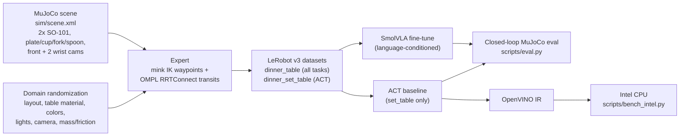

# Dinner-Table VLA: dual SO-101 arms in MuJoCo

Two simulated SO-101 arms set a dinner table from natural-language instructions.
Demonstrations come from a motion-planning expert (mink IK + OMPL). They are collected under domain
randomization, stored as LeRobot v3 datasets, and used to fine-tune **SmolVLA** (language-conditioned VLA) and
an **ACT** baseline. The trained policies then run closed-loop back in MuJoCo, and ACT is exported to
**OpenVINO** for Intel CPU inference.

> Demo video: _link pending_

## Architecture



## Tasks

| Task | Arms | Train instructions (3 per task) | Held-out eval instruction |
|---|---|---|---|
| `fork_left` | left | "Place the fork to the left of the plate." ... | "Position the fork left of the plate." |
| `spoon_right` | right | "Place the spoon to the right of the plate." ... | "Position the spoon right of the plate." |
| `cup_tr` | right | "Put the cup at the top right of the plate." ... | "Move the cup to the upper right corner of the place setting." |
| `set_table` | **both at once** | "Set the table." ... | "Arrange the cutlery for a meal." |

A placement counts as a success when all of these hold:
- the object is within 3 cm of its target
- it rests on the table
- cutlery yaw is within 45° of the target yaw
- the cup is within 30° of upright (an upside-down cup fails)
- the arm's gripper has released

## Domain randomization

Every range below is multiplied by `RAND_LEVELS`: nominal = 1.0 (training), heavy = 1.5 (robustness eval).

| Factor | Nominal range |
|---|---|
| Object and plate position / yaw | ±4 cm / ±30°, rejection-sampled: no overlaps, no object near a target |
| Table material | 3 materials swapped per episode (checker, wood, grey) |
| Object colors | ±0.15 RGB |
| Lights | position ±0.3 m, diffuse ±30%, shadows on 80% of episodes |
| Front camera | position ±2 cm, look-at ±4 cm, fovy ±5° |
| Physics | mass and friction ±20% |

## Quickstart

```bash
uv sync                                      # Python 3.12, pinned lerobot==0.6.1 (uv.lock)
uv run python -m dinner.env                  # scene/env self-check (asserts)
uv run python -m dinner.expert --seeds 20    # expert success per task
```

**1. Collect demonstrations** (~1.5 h on an M4, ~200 episodes):
```bash
uv run python -m scripts.collect --episodes-per-task 50
```

**2. Train** (Apple Silicon shown; use `--policy.device=cuda` on NVIDIA):
```bash
PYTORCH_ENABLE_MPS_FALLBACK=1 uv run lerobot-train --policy.type=act --policy.device=mps --policy.push_to_hub=false \
  --dataset.repo_id=local/dinner_set_table --dataset.root=data/dinner_set_table \
  --batch_size=8 --steps=8000 --output_dir=outputs/train/act_dinner --wandb.enable=false

PYTORCH_ENABLE_MPS_FALLBACK=1 uv run lerobot-train --policy.path=lerobot/smolvla_base --policy.device=mps --policy.push_to_hub=false \
  --dataset.repo_id=local/dinner_table --dataset.root=data/dinner_table \
  --rename_map='{"observation.images.front": "observation.images.camera1", "observation.images.left_wrist": "observation.images.camera2", "observation.images.right_wrist": "observation.images.camera3"}' \
  --batch_size=8 --steps=20000 --output_dir=outputs/train/smolvla_dinner --wandb.enable=false
```

**3. Closed-loop evaluation** (held-out seeds ≥ 10000):
```bash
CKPT=outputs/train/smolvla_dinner/checkpoints/last/pretrained_model
uv run python -m scripts.eval --policy smolvla --ckpt $CKPT --video
uv run python -m scripts.eval --policy smolvla --ckpt $CKPT --paraphrases eval   # unseen instruction wording
uv run python -m scripts.eval --policy smolvla --ckpt $CKPT --rand heavy         # 1.5x randomization
uv run python -m scripts.eval --policy act --ckpt outputs/train/act_dinner/checkpoints/last/pretrained_model
uv run mjpython -m scripts.eval --policy smolvla --ckpt $CKPT --viewer           # live viewer (macOS)
```

**4. OpenVINO export and Intel benchmark:**
```bash
ACT=outputs/train/act_dinner/checkpoints/last/pretrained_model
uv run python -m scripts.export_openvino --act-ckpt $ACT       # IR + end-to-end parity check
uv run python -m scripts.bench_intel --ckpt $ACT               # run on x86 Intel hardware
uv run python -m scripts.eval --policy act --ckpt $ACT --backend openvino
```

**5. Docker** (CPU, headless). Either mount a checkpoint or pass an HF Hub repo id as `--ckpt`:
```bash
docker build -t dinner-vla .
docker run --rm -v $PWD/outputs/train/smolvla_dinner/checkpoints/last/pretrained_model:/app/ckpt:ro \
  -v $PWD/results:/app/results dinner-vla --policy smolvla --ckpt /app/ckpt --episodes 1 --video
```

## Results

_Pending: generated from `results/*.json`._

| Policy | Randomization | Instructions | fork_left | spoon_right | cup_tr | set_table | p50 inference |
|---|---|---|---|---|---|---|---|
| SmolVLA | nominal | train | | | | | |
| SmolVLA | nominal | held-out | | | | | |
| SmolVLA | heavy | train | | | | | |
| ACT | nominal | — | n/a | n/a | n/a | | |
| ACT (OpenVINO, Intel CPU) | — | — | | | | | |

## Limitations

- **The plate is not grasped.** It's a randomized reference object; a thin disc isn't graspable by the SO-101 jaw in this time frame.
- **Dual-arm planning is sequential.** Each arm is planned with the other held at its start pose, then both run at once. Arm–arm conflicts are caught by the rollout success filter, not by joint planning.
- **Carried objects aren't collision-checked.** OMPL checks the arm but not the object it holds; transit height and the success filter cover this.
- **ACT has no language input,** so it's trained and evaluated on `set_table` only.

## Repo layout

```
sim/scene.xml            scene: table, objects, cameras, lights, 2x <attach> SO-101
sim/so101/               MuJoCo Menagerie robotstudio_so101 @ 8161bba (Apache-2.0)
dinner/env.py            env, tasks + paraphrases, randomization, success
dinner/expert.py         mink IK + OMPL expert, rollout()
scripts/collect.py       expert -> LeRobot datasets
scripts/eval.py          closed-loop eval (torch / OpenVINO), metrics JSON, videos
scripts/export_openvino.py   ACT -> ONNX -> IR with parity check; SmolVLA attempt
scripts/bench_intel.py   OpenVINO vs torch CPU latency
```
